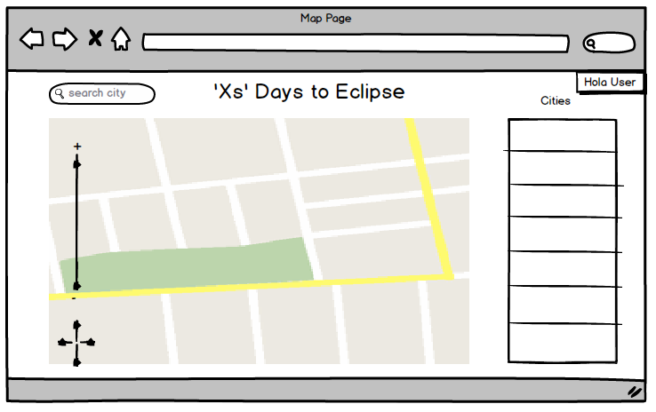

# Solar Eclipse Planner

Solar Eclipse Planner is an app that will help you to plan your trip to witness the 2017 solar eclipse in the US, the also called American Eclipse.

By providing a map to the user, he/she will be able to give any coordinates and the app will provide with entries from airbnb nearby that location.

Finally the user can save the airbnb houses that is most interested in and check them out later.

[Solar Eclipse Planner deployed online with Heroku](https://solareclipseplanner.herokuapp.com/)

[Pivotal Tracker with User Stories](https://www.pivotaltracker.com/n/projects/1593983)

## Wireframes

# Screenshots

# Technologies Used

The app is build on MEAN stack. 

| Technology             | Role                                     |
| ---------------------- | ---------------------------------------- |
| Mongo                  | Databa                                   |
| Express                | Framwork for node.js for the backend     |
| Angular                | Frontend                                 |
| Node.js                | Javascript for the backend               |
| mongoose               | Framework for mongo                      |
| mongoose-bcrypt        | Encrypts passwords to store then in the database |
| dotenv                 | Hide certain files and keys when pushing commits online |
| request-promise        | Handles call to third party servers in the backend |
| cheerio                | JQuery for backend                       |
| materialize            | CSS framework                            |
| ui-router              | to configure routes with angular and create a single page app |
| geonames-API           | Find postal codes and cities with given coordinates |
| google-maps-API        | Generates a map and interacts with it    |
| Nasa eclipse documents | Provides technical data for the eclipse  |
| Airbnb-API             | Not a public API, provides information about its database |

# Intallations Intructions

Fork the repository and/or copy it to you local HD.Run the following command in your terminal:

​	•npm install

​	•npm install mongoose

​	•npm install

